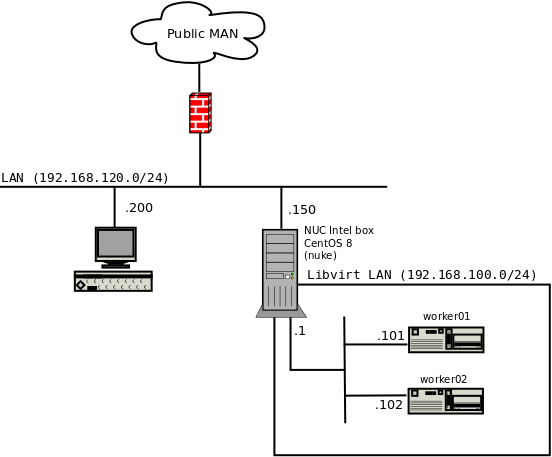

## hashistuff
This is a repository with Various works and studies on Hashicorp nomad, consul and vault.
I appreciate all those on-line classes, but actually the best way is the DYI approach. 

* How to setup secure [Nomad cluster](nomad/README.md),
* How to setup secure [Consul cluster](consul/README.md), 
* How to setup [Vault](vault/README.md) with secure consul backend,
* How to setup [transit auto-unseal](vault/transit.md) vault,
* HOW to setup my own [Root CA, intermediate CA and certs](cfssl/README.md) for clusters services, communication and web.

### Prerequisites

* A CentOS 8 machine with min. 8GB RAM, 4 cores and 128G HDD/SSD
* A fully controlled local WiFi or any other LAN,
* Libvirtd active and configured as NAT, with static IPs and dnsmasq turned off on CentOS 8,
* BIND 9 installed and configured for hosts in both nets: public LAN and Libvirtd (can be installed on the CentOS 8 box or anywhere else in the LAN).

### Network diagram

Here's a diagram of a simple LAN with a NUC box being a firewall/router between the LAN and a virtual LAN set in libvirt. This is the environment where I am going to set up a lab grade Nomad+Consul+Vault cluster.
The HW is just an old Intel NUC box with Intel N3700 4cores, 8GB RAM and 256 SSD. It's enough for a lab, way below minimum if you think of any serious use of it. :) The KVM (libvirt) virtual machines are stripped down 1.5GB, 1core Ubuntu 16.04 images. Had them ready at hand. 

The below is a diagram which shows how I am going to set up the cluster (or actually the three clusters of: nomad, consul and vault). All key components are installed as systemd services. Of course, as a prerequisite for any successful orchestration cluster, I need also configured and running Docker. 

.

### Bibliography

 * [CloudFlare: cfssl & cfssljson](https://github.com/cloudflare/cfssl),
 * [Hashicorp: Enable TLS encryption for Nomad](https://learn.hashicorp.com/nomad/transport-security/enable-tls),
 * [Hashicorp: Nomad ACL system fundamentals](https://learn.hashicorp.com/nomad/acls/fundamentals),
 * [Hashicorp: Nomad clustering](https://learn.hashicorp.com/nomad/getting-started/cluster),
 * [Hashicorp: Secure Consul with ACL](https://learn.hashicorp.com/consul/security-networking/production-acls),
 * [Hashicorp: Consul: managing ACL policies](https://learn.hashicorp.com/consul/security-networking/managing-acl-policies),
 * [Hashicorp: Auto-unseal using Transit Secrets Engine](https://learn.hashicorp.com/vault/operations/autounseal-transit),
 * [Hashicorp: Transit seal](https://www.vaultproject.io/docs/configuration/seal/transit/),
 * [Katakoda: Vault Auto-Unseal](https://www.katacoda.com/hashicorp/scenarios/vault-auto-unseal),
