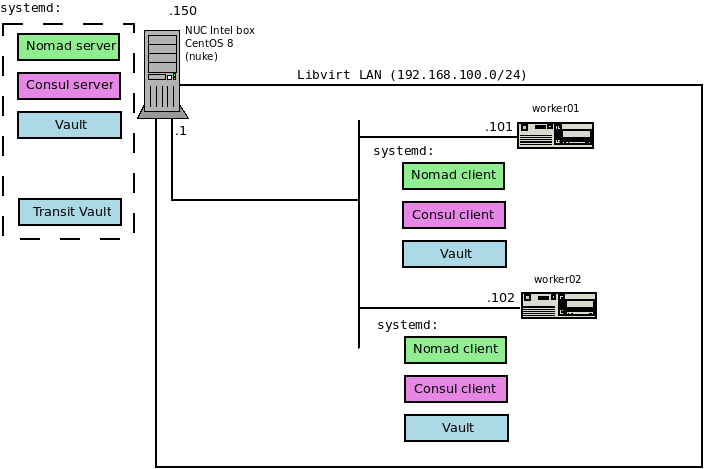

## hashistuff
This is a repository with Various works and studies on Hashicorp nomad, consul and vault. I appreciate all those on-line classes, and (sometimes not quite intuitive) documentation, but actually the best way is the DYI approach. Setting up a secure Nomad cluster supported by consul and vault featuring transit autounseal is rather a complex task. Hence, I divided this complex task into the list of steps in the following order:

1. Generate all neccessary TLS certificates (root, intermediate, host ones),
2. Setup basic Nomad cluster,
3. Setup basic Consul cluster,
4. Setup TLS and ACL (blacklisting) for Nomad,
5. Setup TLS for Consul,
6. Setup Vault cluster and TLS,
7. Setup Master Transit Vault instance with TLS,
8. Enable transit auto-unseal on the Vault cluster,
9. Setup ACL for Consul,

Done. This task took me overall some 30 hours reading documentation, Hashicorp issues, logs, troubleshooting etc. It was fun. :) If I had a more powerful platform (with more RAM and cores) I'd certainly configure a setup more closely reflecting production environment - like 3 cluster server agents (Nomad and Consul). So, if you have more horsepower under the hood, the setup presented in this tutorial can be creatively expanded without any major problem.

From this tutorial you can learn the following aspects of hashicorp stuff: 

* How to setup secure [Nomad cluster](nomad/README.md),
* How to setup secure [Consul cluster](consul/README.md), 
* How to setup [Vault](vault/README.md) with secure consul backend,
* How to setup [transit auto-unseal](vault/README-transit.md) vault,
* How to setup my own [Root CA, intermediate CA and certs](cfssl/README.md) for clusters services, communication and web.

### Prerequisites

* A CentOS 8 machine with min. 8GB RAM, 4 cores and 128G HDD/SSD
* A fully controlled local WiFi or any other LAN,
* Libvirtd active and configured as NAT, with static IPs and dnsmasq turned off on CentOS 8,
* BIND 9 installed and configured for hosts in both nets: public LAN and Libvirtd (can be installed on the CentOS 8 box or anywhere else in the LAN).

__Note:__ By default, there's Podman installed in CentOS 8 as the containers runtime. No worries, the Nomad server does not use it. The Nomad clients have docker.io package installed.

### Network diagram

Here's a diagram of a simple LAN with a NUC box being a firewall/router between the LAN and a virtual LAN set in libvirt. This is the environment where I am going to set up a lab grade Nomad+Consul+Vault cluster.
The HW is just an old Intel NUC box with Intel N3700 4cores, 8GB RAM and 256 SSD. It's enough for a lab, way below minimum if you think of any serious use of it. :) The KVM (libvirt) virtual machines are stripped down 1.5GB, 1core Ubuntu 16.04 images. Had them ready at hand. 

The below is a diagram which shows how I am going to set up the cluster (or actually the three clusters of: nomad, consul and vault). All key components are installed as systemd services. Of course, as a prerequisite for any successful orchestration cluster, I need also configured and running Docker. As you can see the clustering setup is quite simple: 1 server + 2 workers. Unfortunately, this setup will not let me try some HA scenarios, I'd need another NUC.

.

### Secrets in this tutorial

All secrets mentioned in this tutorial come from a home lab setup. They are solely presented for the sake of this tutorial.  Normally, I would store them aside securely and never disclose to the Internet audience. At a firm, you should follow some security rules or advisory, should you have any serious ITSec folks on board. Use your local PKI or any other sec tech stuff to secure your Root CA, root access tokens and encryption tokens.

### Bibliography

 * [CloudFlare: cfssl & cfssljson](https://github.com/cloudflare/cfssl),
 * [Hashicorp: Enable TLS encryption for Nomad](https://learn.hashicorp.com/nomad/transport-security/enable-tls),
 * [Hashicorp: Nomad ACL system fundamentals](https://learn.hashicorp.com/nomad/acls/fundamentals),
 * [Hashicorp: Nomad clustering](https://learn.hashicorp.com/nomad/getting-started/cluster),
 * [Hashicorp: Secure Consul with ACL](https://learn.hashicorp.com/consul/security-networking/production-acls),
 * [Hashicorp: Consul: managing ACL policies](https://learn.hashicorp.com/consul/security-networking/managing-acl-policies),
 * [Hashicorp: Auto-unseal using Transit Secrets Engine](https://learn.hashicorp.com/vault/operations/autounseal-transit),
 * [Hashicorp: Transit seal](https://www.vaultproject.io/docs/configuration/seal/transit/),
 * [Katakoda: Vault Auto-Unseal](https://www.katacoda.com/hashicorp/scenarios/vault-auto-unseal),
